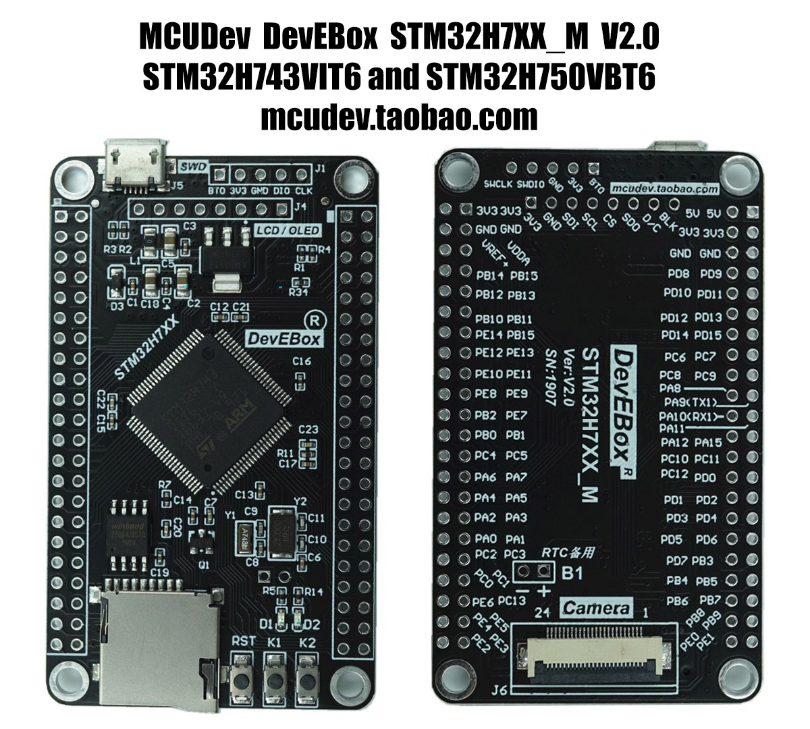

# MCUDev DevEBox STM32H7XX_M

MicroPython board definition files for the MCUDev STM32H7XX_M mini dev boards.

There are two versions with different STM32H7 chips:

* STM32H750VBT6 - 128K flash
* STM32H743VIT6 - 2048K flash

**Markings:** DevEBox STM32H7XX_M Ver:V2.0 SN:1907



You can buy one for around $29 AUD (Feb 2020) on [AliExpress].

### Build the firmware

Clone the board definitions to your [MicroPython](https://github.com/micropython/micropython) `ports/stm32/boards` folder.

```bash
cd micropython/ports/stm32/boards
git clone https://github.com/mcauser/MCUDEV_DEVEBOX_H7XX_M.git

cd ..
make BOARD=MCUDEV_DEVEBOX_H7XX_M
```

### Flashing via DFU

This board can be flashed using DFU. To put the board in DFU mode, disconnect
USB, set BOOT0 to ON by connecting pin BT0 to 3V3 and reconnect USB.

Now you can flash the board using USB with the command:

```bash
make BOARD=MCUDEV_DEVEBOX_H7XX_M deploy
```

Once the upload is complete, disconnect USB, set BOOT0 to OFF by connecting
pin BT0 to GND and reconnect USB.

Alternatively, you can use the MicroPython command `pyb.bootloader()`
to get into DFU mode without needing to use the switch.

Currently, you need to unplug and replug the board in order to switch from DFU
mode back to regular mode.

### Accessing the board

Once built and deployed, you can access the MicroPython REPL (the Python prompt) via USB serial.

```bash
screen /dev/tty.usbmodem1422 115200
# or
screen /dev/ttyACM0 115200
```

### STM32H750VBT6 Specifications

* STM32H750VBT6 ARM Cortex M7
* 128 Kbyte Flash, 1 Mbyte RAM

### STM32H743VIT6 Specifications

* STM32H743VIT6 ARM Cortex M7
* 2 Mbyte Flash, 1 Mbyte RAM

### Common Specifications

* 400MHz, 1027 DMIPS / 2.14 DMIPS / MHz
* 25MHz system crystal
* 32.768KHz RTC crystal
* SWD header (BOOT0, 3V3, GND, PA13/SWDIO, PA14/SWCLK)
* 6x SPI, 4x USART, 4x UART, 1x LPUART, 3x I2S, 1x LPI2S, 4x I2C
* 4x SAI, SPDIFRX, SWPMI, MDIO Slave, 2x SD/SDIO/MMC, 2x CAN
* 2x USB OTG, 1x FS, 1x HS/FS
* Micro SD
* Winbond W25Q64 64Mbit QSPI Flash
* 1x 10/100 Ethernet MAC with DMA
* HDMI-CEC
* 1x 8 to 14-bit Parallel Camera interface
* 3x ADC (16-bit / 36-channel)
* 1x temperature sensor
* 2x DAC (12-bit)
* 2x ULP comparators
* 2x Op Amps
* 1x high res timer, 2x 32-bit timers, 2x advanced timers, 10x general timers,
* 5x low power timers, 2x watchdogs, 1x systick timer
* 96-bit unique ID
* AMS1117-3.3V: 3.3V LDO voltage regulator, max current 800mA
* Micro USB for power and comms
* Power LED D1
* User LED D2 (PA1) active low
* Reset button, 2x user buttons K1 (PE3), K2 (PC5)
* 2x22 2.54mm side headers
* DCMI camera interface (OV2640, OV5640)
* SPI TFT/OLED header (3V3, GND, SDI, SCL, CS, SDO, D/C, BLK)
* RTC battery header B1 beside camera interface
* M3 mounting holes
* Dimensions: 40.89mm x 68.59mm

### Exposed Port Pins

* PA0-PA15
* PB0-PB15
* PC0-PC13 (PC14 OSC32_IN and PC15 OSC32_OUT not broken out)
* PD0-PD15
* PE0-PE15

Note: The PB15 next to PE14 is mislabelled. It should be PE15.

### Peripherals

#### TFT/OLED (J4)

* 1 3V3
* 2 GND
* 3 PB15 MOSI
* 4 PB13 SCK
* 5 PB12 CS
* 6 PB14 MISO
* 7 PB1 RS
* 8 PB0 BLK

#### QSPI Flash W25Q64 (U3)

* 1 PB6 QSPI_BK1_NCS
* 2 PD12 QSPI_BK1_IO1
* 3 PE2 QSPI_BK1_IO2
* 4 GND
* 5 PD11 QSPI_BK1_IO0
* 6 PB2 QSPI_CLK
* 7 PD13 QSPI_BK1_IO3
* 8 VCC 3V3

#### SWD debug (J1)

* 1 Boot0
* 2 3V3
* 3 GND
* 4 PA13 SWDIO
* 5 PA14 SWCLK

#### USB (J5)

* 1 VCC 5V
* 2 PA11 USB_DM
* 3 PA12 USB_DP
* 4 NC ID
* 5 GND

#### Micro SD (U5)

* 1 PC10 SDIO_D2
* 2 PC11 SDIO_D3
* 3 PD2 SDIO_CMD
* 4 3V3
* 5 PC12 SDIO_SCK
* 6 GND
* 7 PC8 SDIO_D0
* 8 PC9 SDIO_D1
* 9 NC SD_NC

#### User Button (K1)

* PE3

#### User Button (K2)

* PC5

#### User LED (D2)

* PA1

#### Battery (B1)

* 1 BAT54C
* 2 GND

### Links

* [STM32H750VB on st.com](https://www.st.com/en/microcontrollers-microprocessors/stm32h750vb.html)
* [STM32H743VI on st.com](https://www.st.com/en/microcontrollers-microprocessors/stm32h743vi.html)
* Buy on [AliExpress] or search for "STM32H750VBT6" or "STM32H743VIT6"
* Buy on [Taobao](https://item.taobao.com/item.htm?id=601083694791)
* [STM32H7XX_M schematics](https://github.com/mcauser/MCUDEV_DEVEBOX_H7XX_M/blob/master/docs/STM32H7XX_M_schematics.pdf)

### Related boards

* [MCUDev Black STM32F407VET6](https://github.com/mcauser/BLACK_F407VE)
* [MCUDev Black STM32F407ZET6](https://github.com/mcauser/BLACK_F407ZE)
* [MCUDev Black STM32F407ZGT6](https://github.com/mcauser/BLACK_F407ZG)
* [MCUDev DevEBox STM32F407VET6](https://github.com/mcauser/MCUDEV_DEVEBOX_F407VET6)
* [MCUDev DevEBox STM32F407VGT6](https://github.com/mcauser/MCUDEV_DEVEBOX_F407VGT6)
* [MCUDev DevEBox STM32H7XX_M](MCUDEV_DEVEBOX_H7XX_M) - this board
* [VCC GND STM32F407VET6 Mini](https://github.com/mcauser/VCC_GND_F407VE)
* [VCC GND STM32F407ZGT6 Mini](https://github.com/mcauser/VCC_GND_F407ZG)

[AliExpress]: https://www.aliexpress.com/item/4000300005466.html

## License

Licensed under the [MIT License](http://opensource.org/licenses/MIT).
